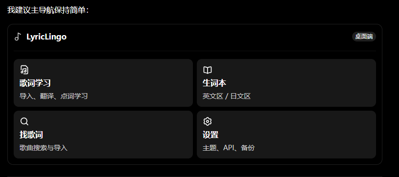
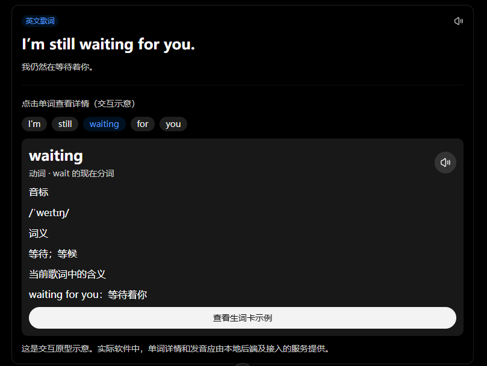
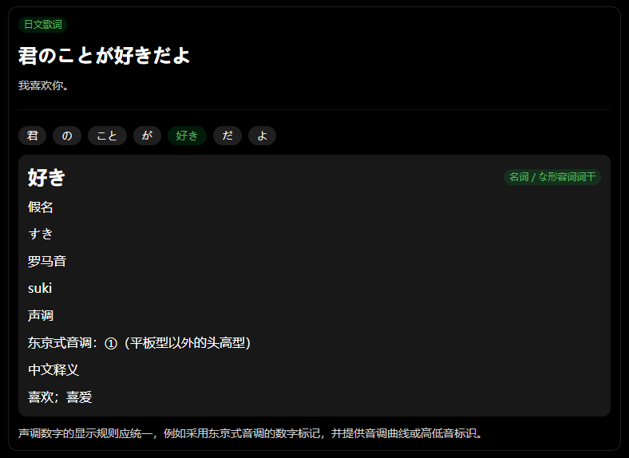
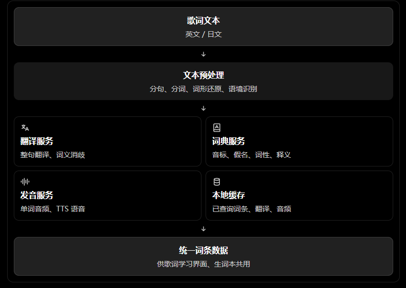
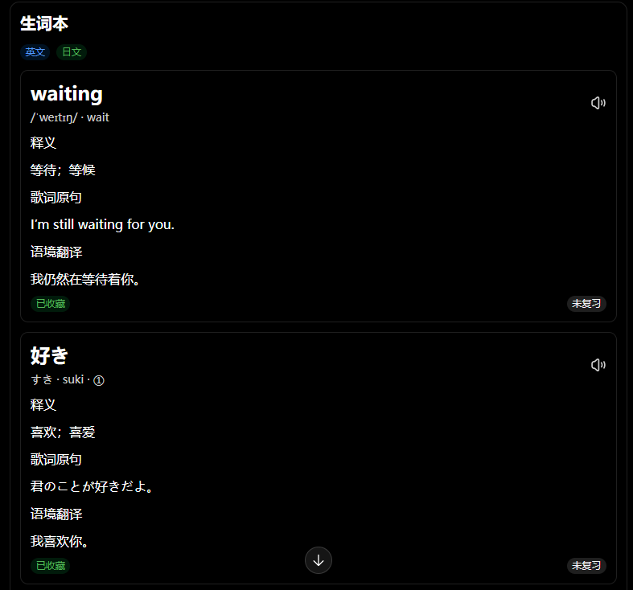

## 个人想法

### 我想要做一个软件：

1、这个软件可以传入歌词，然后能自动地把每一句歌词进行翻译，并且点击每个词能出现该词的读音（例如英文的音标、日文的假名、罗马音和音调）和词义（我觉得这块应该可以接api，直接调用api获取翻译），如果有发音的音频就更好了。

2、然后能将该词添加到生词本中，并且可以看到读音和详细的翻译（英译中和日译中）和发音音频。

3、其中传入歌词，系统需要提供一个文本输入块给用户粘贴歌词，或者本地上传歌词文本。

4、如果有发音的话，用小喇叭做图标。

5、生词本需要分英文区和日文区，在加入生词本时就要区分好。

6、需要有搜索歌名对应的歌词的功能。

7、不需要登陆等操作，作为个人使用

### 前端界面风格：

简洁易操作，色调可以自己自由选择(在设置中改变)，例如#8ac4e2、#b5dbe5、#d3eed9渐变色，#27a6cc、#80bfd4、#fcc5c5渐变色，#a8d5ba、#d7e8bd、#fff3c7渐变色，#303d67、#79799a、#fddfdc渐变色，暂时就这四种，然后其他的纯色可自由输入。

### 技术栈：

前端用electron，后端用go+gin+gorm+viper+wire，数据库可用mysql8或pgsql16，如果有需要缓存则用redis，如果需要用到搜索引擎则用elasticsearch

我觉得后端架构使用handler、service、dao三层，还有model、req（加入validate）、resp、provider、middleware（日志、错误、recovery）、config（代码：读取configs中的配置文件和.env里的数据）、configs（放配置文件）、.env（本地环境变量，放敏感数据）、db（放数据库、搜索引擎等等的配置代码）

## ChatGPT建议：

### 一、重点优化三个方面：

**歌词与单词的关联方式：**点击歌词中的任意单词，就能准确展示它的读音、词义和语境。

**词汇数据的获取方式：**不要完全依赖翻译 API，而是组合词典、词形还原、翻译和发音服务。

**本地数据与架构**：既然是个人使用、无需登录，就应该尽量减少部署和维护成本。

### 二、核心界面分成四个模块：

1、歌词学习
粘贴或导入歌词，自动分句、翻译。点击句子中的单词，即可查看读音、词义、词性和上下文。
2、生词本
英文和日文分区，支持搜索、筛选、查看详细释义、播放发音，以及标记熟悉程度。
3、歌曲搜索
输入歌名/歌手/歌词，能搜到已导入的对应的所有歌词信息
4、设置中心
主体颜色默认为白色。选择四种预设渐变主题，或者自定义纯色；管理翻译 API、发音服务等。

### 三、歌词学习界面：建议重点设计「点击单词」

这是整个软件最有价值的功能，也是技术上最需要提前考虑的地方。

#### 1. 推荐的交互方式

例如用户导入这句英文歌词：

#### 2. 日文需要更特殊的处理

日语不能简单地把每个空格分隔的字符串当成一个单词，因为日语通常没有词间空格。

例如：

日语建议使用专门的形态分析工具进行分词、词性判断、假名读取和词形还原，而不是依赖大模型临时猜测。

#### 3. 需要支持词形还原

这点非常重要。

例如歌词中出现：

| 歌词里的词     | 词典中的基本形 |
| -------------- | -------------- |
| waiting        | wait           |
| loved          | love           |
| running        | run            |
| 好きだった     | 好き（すき）   |
| 行ってしまった | 行く（いく）   |

用户点击歌词中的词，应该看到原词 + 词典基本形 + 当前语境释义。

而且添加生词时，可以让用户选择：

- 添加歌词中的原始形式。
- 添加词典基本形。
- 将原始形式作为例句保留。

这样能避免生词本中出现大量重复词条。

### 四、翻译与词典：不要让一个 API 包办全部

你提到接 API 获取翻译，这个方向是对的，但建议采用「多服务组合 + 统一接口」的设计。

因为翻译、词典、发音、日语分词其实是不同的能力。

我建议的服务组合

| 能力           | 推荐实现思路                       |
| -------------- | ---------------------------------- |
| 英文分词       | Go 侧接入成熟 NLP 库或词典分词方案 |
| 英文音标       | 本地词典优先，缺失时查询词典 API   |
| 日文分词       | MeCab / Sudachi 等形态分析工具     |
| 日文假名与词形 | 形态分析器及日语词典               |
| 日文音调       | 带音调数据的日语词典服务           |
| 整句翻译       | 可配置的翻译 API                   |
| 词义补充       | 词典 API + 语境翻译                |
| 发音           | 词典原生音频优先，TTS 作为补充     |

关键建议：把 API 封装成 Provider 接口。

例如定义：

- `TranslationProvider`
- `DictionaryProvider`
- `PronunciationProvider`
- `LyricsProvider`

以后更换翻译服务，或者新增一个词典服务，不需要修改整个业务层。

另外，翻译 API 的调用应当支持批量请求、缓存和失败重试。歌词中的同一个词可能出现几十次，没必要每次都重新查询。

### 五、生词本：不仅要保存单词，还要保存学习语境

我建议英文和日文是两个独立的分类入口，但底层使用统一的数据模型。

此处有个建议，因为一个单词可能在多个歌词中出现，所以歌词原句和语境翻译需考虑只存一个还是多个。

### 生词数据应该包含什么？

建议至少保存这些字段：

| 字段          | 用途           |
| ------------- | -------------- |
| language      | en / ja        |
| word          | 原始单词       |
| lemma         | 词典基本形     |
| phonetic      | 英文 IPA       |
| kana          | 日文假名       |
| romaji        | 日文罗马音     |
| accent        | 日语音调数据   |
| meanings      | 详细中文释义   |
| examples      | 原歌词及翻译   |
| audio         | 音频缓存地址   |
| source        | 来源词典 / API |
| created_at    | 添加时间       |
| review_status | 学习状态       |

个人觉得英文单词和日文单词应该分为两张字段不同的表。

特别建议增加一个 `word_sense`（词义）概念。

同一个英文单词可能有多个意思，同一个日文词也可能存在不同词性和读音。生词本应该允许用户选择当前歌词里的具体词义，而不是只保存一个模糊的中文翻译。

目前还有个问题是，单词音频要从哪里来？

